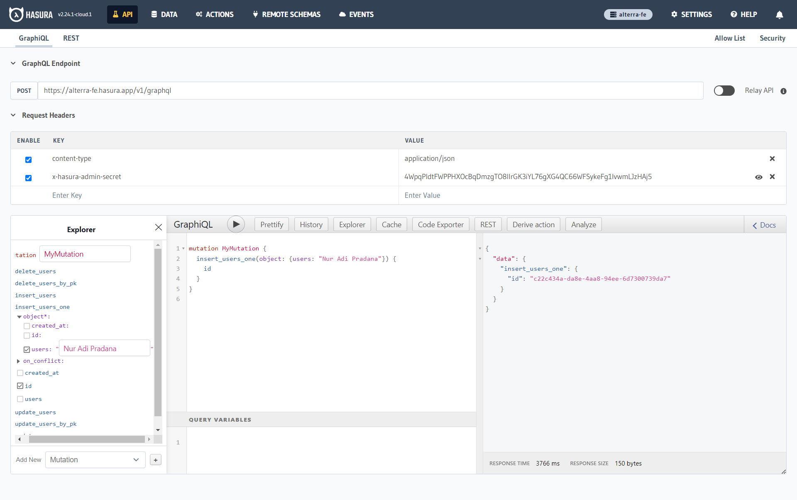
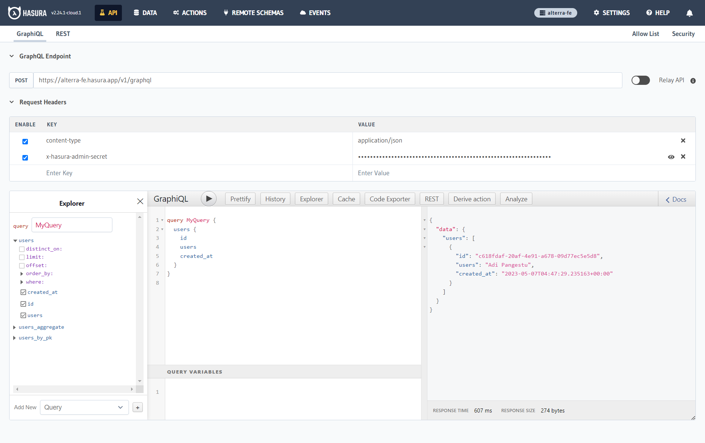

# Project Alterra Frontend Developer

Project Studi Independent Kampus Merdeka Batch 4 Aterra Academy.

## Demo

https://alterra-fe.vercel.app/

## Demo Account

Demo account to acces this project

```bash
  admin@admin.com
  admin123
```

## Run Locally

Clone the project

```bash
  git clone https://github.com/Adi1162/alterra-fe.git
```

Go to the project directory

```bash
  cd alterra-fe
```

Install dependencies

```bash
  npm install
```

Start the server

```bash
  npm run dev
```

## Running Tests

To run tests, run the following command

```bash
  npm run test
```

## Tech Stack

- React
- Vite
- Vitest
- Redux
- GraphQL
- MockAPI

## Screenshots



